# LAPORAN PRAKTIKUM PEMROGRAMAN WEB 2
## Praktikum 1: PHP Framework (CodeIgniter 4)

**Nama** : Maya Enjelina  
**NIM** : 312410378  
**Kelas** : I243B  
**Repository** : Lab7Web

---

### 1. Persiapan dan Instalasi
Sebelum memulai, saya melakukan instalasi framework CodeIgniter 4. Berdasarkan instruksi:
* **Download CodeIgniter 4**: Melalui website resmi codeigniter.com.
* **Ekstrak File**: Hasil download diekstrak ke folder: `C:\xampp\htdocs\lab11_php_ci\ci4`.
* **Aktivasi Ekstensi**: Mengaktifkan `intl`, `mbstring`, dan `openssl` pada file `php.ini`.
    
    
 
### 2. Menjalankan Server
Untuk menjalankan aplikasi, saya menggunakan PHP Development Server bawaan CodeIgniter dengan mengetikkan perintah berikut pada terminal/command prompt:
php spark serve
Aplikasi kemudian dapat diakses melalui browser dengan alamat http://localhost:8080.
    

### 3. Membuat Controller
Saya membuat sebuah Controller baru bernama Page.php di folder app/Controllers/. Controller ini berfungsi untuk menangani permintaan halaman statis seperti About, Contact, Faqs, dan Tos.
    

Halaman About
    

Halaman TOS
    

### 4. Konfigurasi Routing
Agar alamat URL lebih rapi, saya melakukan konfigurasi pada file app/Config/Routes.php. Saya mendaftarkan rute khusus agar halaman dapat diakses tanpa harus menuliskan nama controller di URL.
    
### 5. Membuat Layout (Header dan Footer)
Untuk menerapkan konsep reusable code, saya membagi tampilan menjadi tiga bagian utama:

1. **Header**: Berisi tag pembuka HTML, navigasi, dan pemanggilan CSS.
2. **Footer**: Berisi sidebar dan tag penutup HTML.
3. **Content**: Isi konten spesifik tiap halaman.
Saya membuat folder template di dalam app/Views/ dan membuat file header.php serta footer.php di dalamnya.
Code header.php
    

Code footer.php
    

### 6. Menambahkan CSS
Agar tampilan sesuai dengan gambar pada modul, saya menambahkan file style.css di folder public/. CSS ini menggunakan teknik float untuk membagi area menjadi bagian main (konten) dan sidebar.
    
 
### 7. Hasil Akhir (Halaman About)
Saya memperbarui method pada Controller dan file View about.php agar menggunakan fungsi include untuk memanggil header dan footer.

---

### 8. Penyelesaian Tugas (Menambah Menu Artikel dan Kontak)
Sesuai dengan instruksi pada bagian "Pertanyaan dan Tugas", saya telah melengkapi navigasi website dengan menambahkan halaman Artikel dan Kontak.

**Langkah yang dilakukan:**
1. **Update Controller**: Menambahkan method `artikel()` dan `contact()`.
2. **Membuat View**: Membuat file `artikel.php` dan `contact.php` di folder `app/Views/`.
3. **Navigasi Aktif**: Mengatur link pada `header.php` agar semua menu dapat diakses.

---

### 9. Kesimpulan
Pada praktikum ini, saya telah berhasil melakukan instalasi CodeIgniter 4, memahami konsep Routing dan Controller, serta mengimplementasikan teknik *Layouting* menggunakan fungsi `include`.
 
------------------------------------------------------------------------------------------------

 ## Praktikum 2 : Framework lanjutan (CRUD)
# Lab 7 - Pemrograman Web 2

Pada praktikum ini, saya melanjutkan pengembangan aplikasi web portal berita dengan menambahkan fitur CRUD (*Create, Read, Update, Delete*) pada menu Admin.

### **1. Membuat Database dan Tabel**
Langkah pertama adalah membuat database `lab_ci4` dan tabel `artikel` menggunakan MySQL.

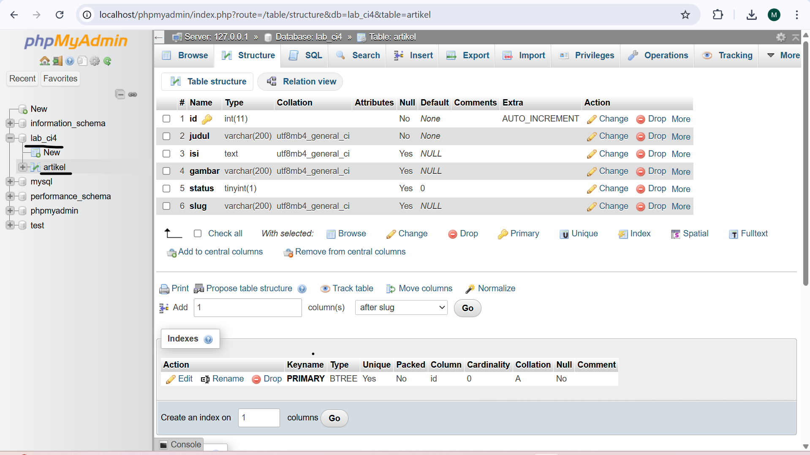

### **2. Mengatur Konfigurasi Database**
Mengubah file `.env` atau `app/Config/Database.php` untuk menghubungkan aplikasi ke database MySQL. Pada praktikum ini kita gunakan konfigurasi pada file .env.

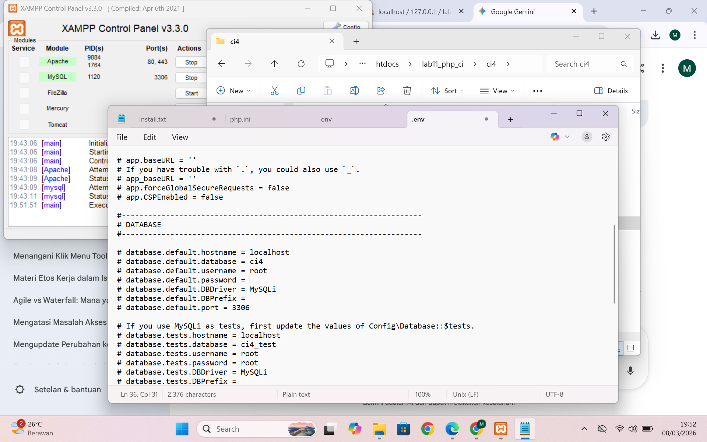

### **3. Menambahkan Data di Database**
Menambahkan beberapa data ke database agar muncul di aplikasi web

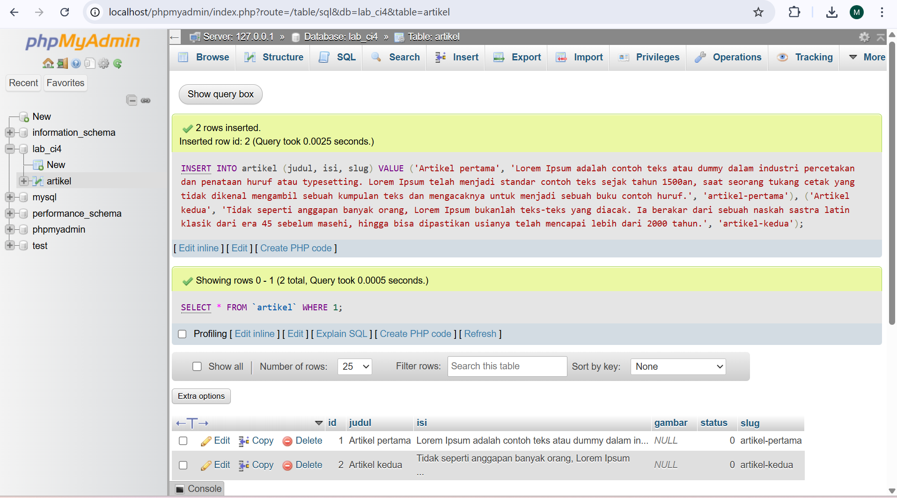

Sehingga akan tampil datanya seperti ini

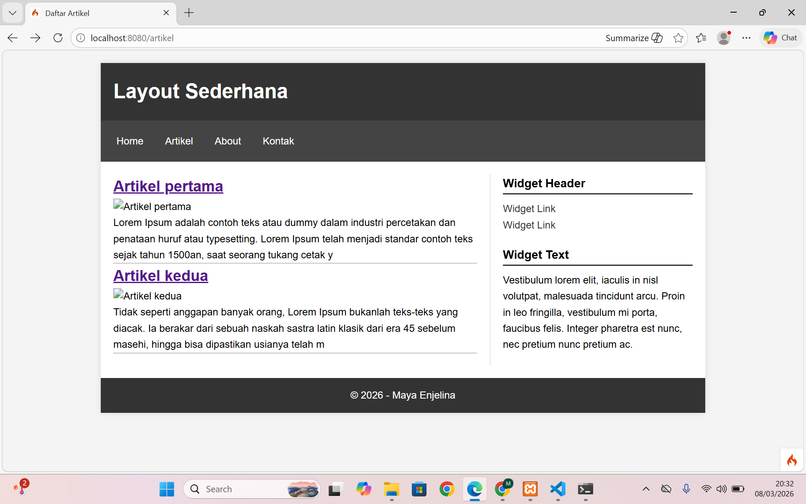

### **4. Membuat Tampilan Detail Artikel**
Tampilan pada saat judul berita di klik maka akan diarahkan ke halaman yang berbeda.
Artikel pertama

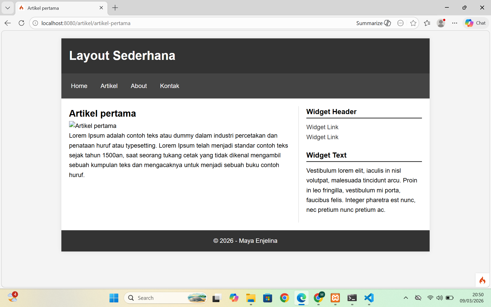

Artikel kedua

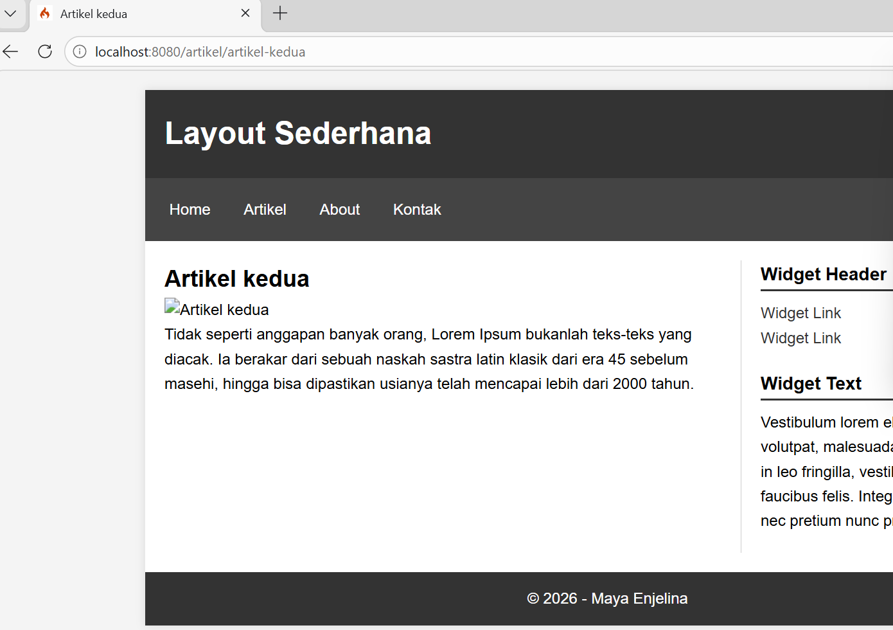

### **5. Membuat Menu Admin**
Membuat menu admin untuk mengelola data artikel. Langkah-langkahnya meliputi:
* **Controller**: Menambahkan method `admin_index()`.
* **View**: Membuat file `admin_index.php` dan template `admin_header.php` serta `admin_footer.php`.
* **Routing**: Mengatur grup rute untuk admin di `app/Config/Routes.php`.

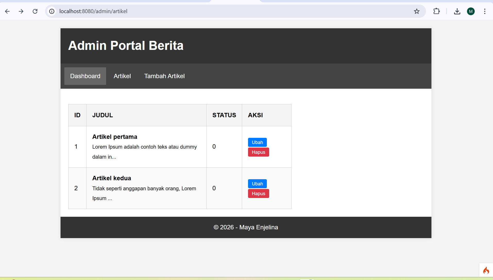

### **6. Fitur Tambah Data (Create)**
Membuat fitur Tambah data agar data dapat di tambah dengan mudah. Langkah langkah meliputi :
* **Controller**: Menambahkan method `add()`.
* **View**: Membuat file `form_add.php`.

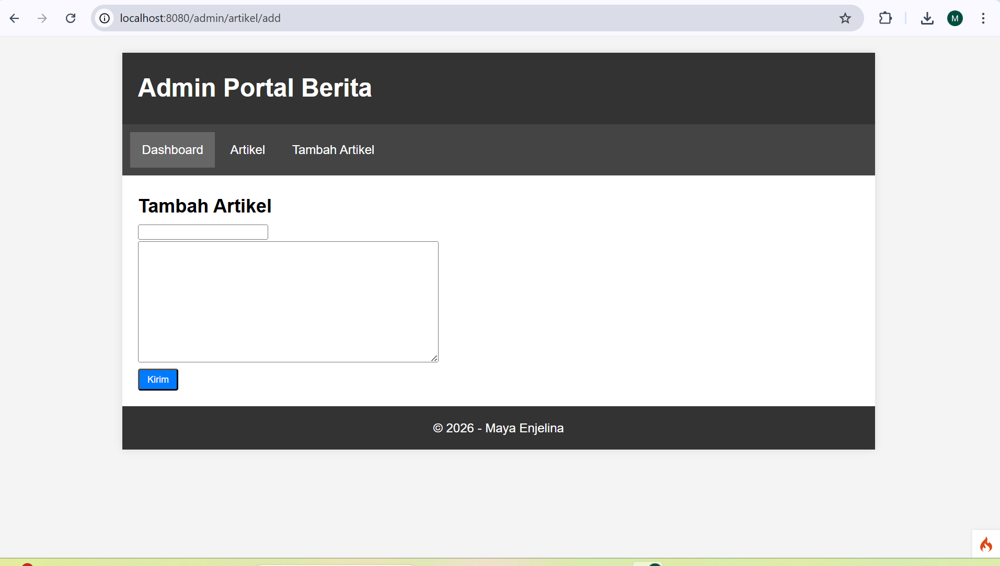

Hasil tambah data

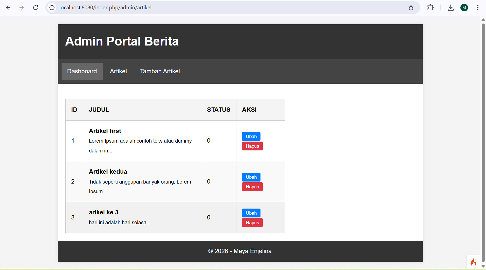

### **7. Fitur Ubah Data (Update)**
Membuat fitur ubah data agar data dapat di ubah dengan mudah. Langkah langkah meliputi :
* **Controller**: Menambahkan method `edit()`.
* **View**: Membuat file `form_edit.php`.

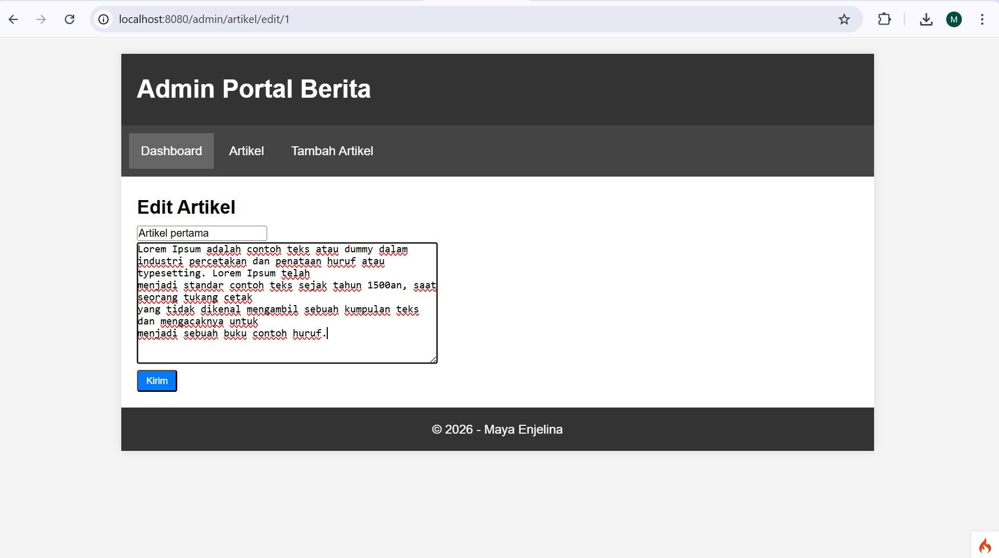

Hasilnya "Artikel petama" menjadi "Artikel first"

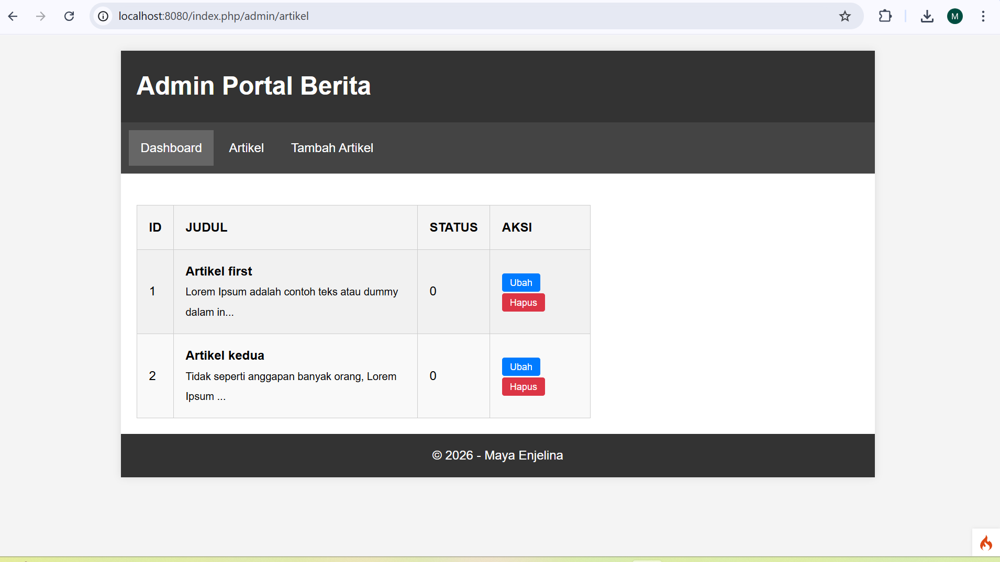

### **8. Fitur Hapus Data (Delete)**
Membuat fitur ubah data agar data dapat di ubah dengan mudah. Langkah langkah meliputi :
* **Controller**: Menambahkan method `delete()`.

