                    LAPORAN PRAKTIKUM PEMROGRAMAN WEB 2
                Praktikum 1: PHP Framework (CodeIgniter 4)

Nama : Maya Enjelina
NIM: 312410378
Kelas: I243B
Repository: Lab7Web

1.	Persiapan dan Instalasi

Sebelum memulai, saya melakukan instalasi framework CodeIgniter 4. Berdasarkan instruksi:
•	Download CodeIgniter 4: Bisa melalui website resmi codeigniter.com (versi Manual Download) atau menggunakan perintah Composer.
•	Ekstrak File: Hasil download tersebut saya ekstrak ke dalam folder web server saya di: C:\xampp\htdocs\lab11_php_ci\ci4.
•	Saya mengaktifkan ekstensi PHP yang dibutuhkan melalui XAMPP Control Panel pada file php.ini, antara lain: extension=intl, extension=mbstring, dan extension=openssl.
    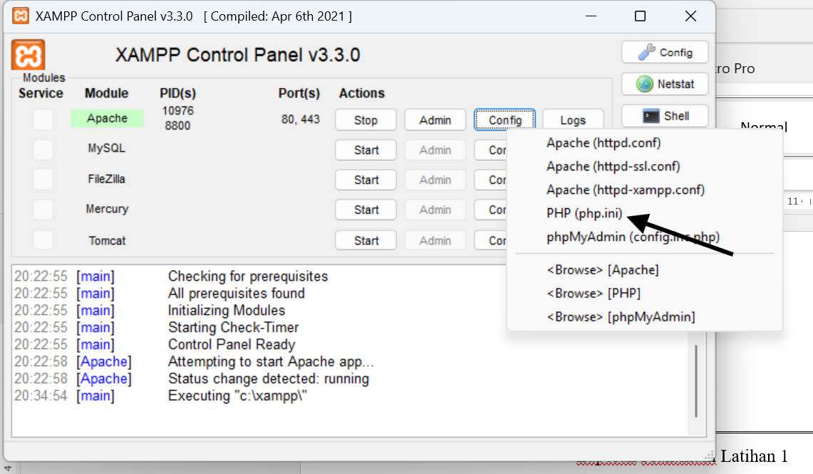
    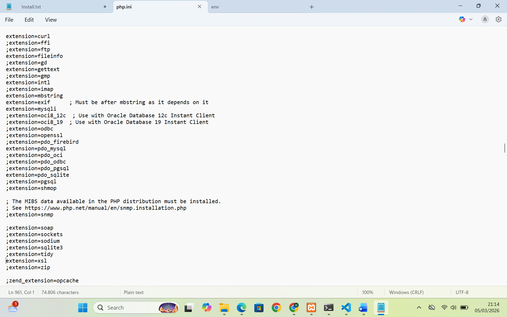
 
2. Menjalankan Server
Untuk menjalankan aplikasi, saya menggunakan PHP Development Server bawaan CodeIgniter dengan mengetikkan perintah berikut pada terminal/command prompt:
php spark serve
Aplikasi kemudian dapat diakses melalui browser dengan alamat http://localhost:8080.
    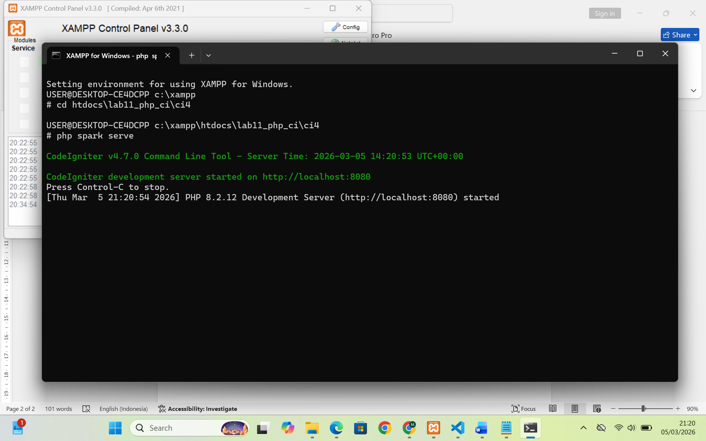

3. Membuat Controller
Saya membuat sebuah Controller baru bernama Page.php di folder app/Controllers/. Controller ini berfungsi untuk menangani permintaan halaman statis seperti About, Contact, Faqs, dan Tos.
    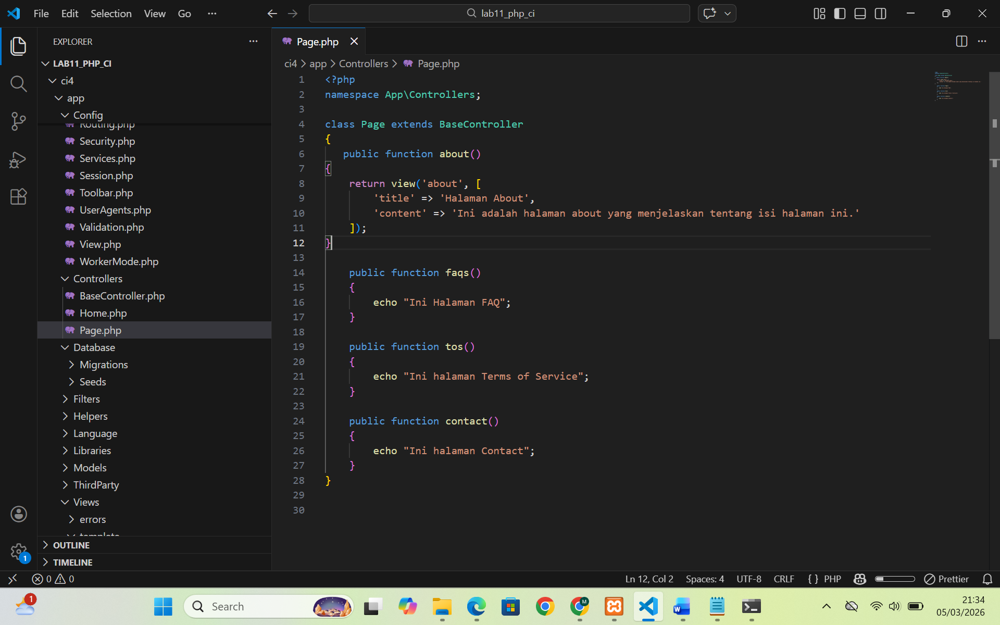

Halaman About
    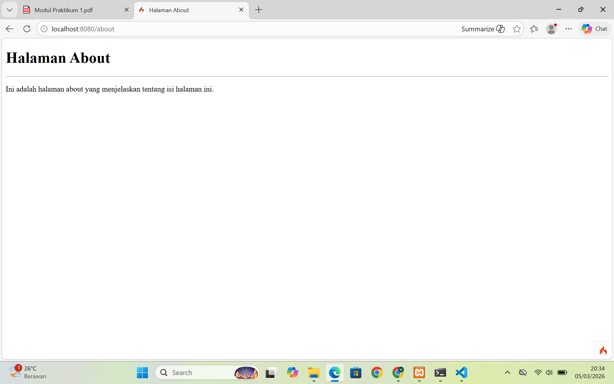

Halaman TOS
    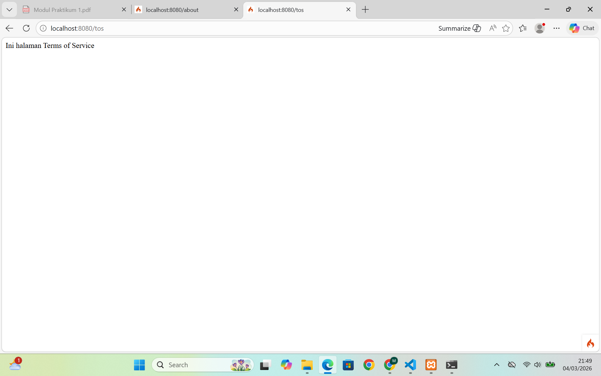

4. Konfigurasi Routing
Agar alamat URL lebih rapi, saya melakukan konfigurasi pada file app/Config/Routes.php. Saya mendaftarkan rute khusus agar halaman dapat diakses tanpa harus menuliskan nama controller di URL.
    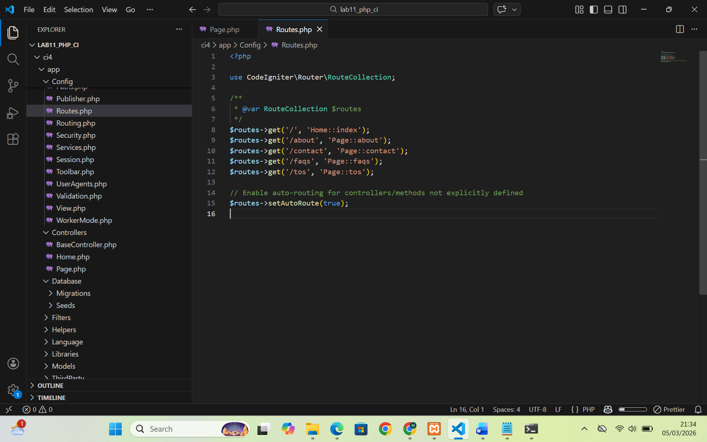

5. Membuat Layout (Header dan Footer)
Untuk menerapkan konsep reusable code, saya membagi tampilan menjadi tiga bagian utama:
        1.	Header: Berisi tag pembuka HTML, navigasi, dan pemanggilan CSS.
        2.	Footer: Berisi sidebar dan tag penutup HTML.
        3.	Content: Isi konten spesifik tiap halaman.
Saya membuat folder template di dalam app/Views/ dan membuat file header.php serta footer.php di dalamnya.
Code header.php
    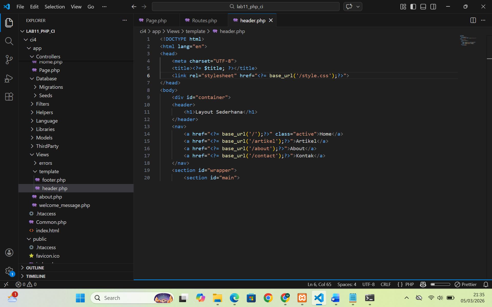

Code footer.php
    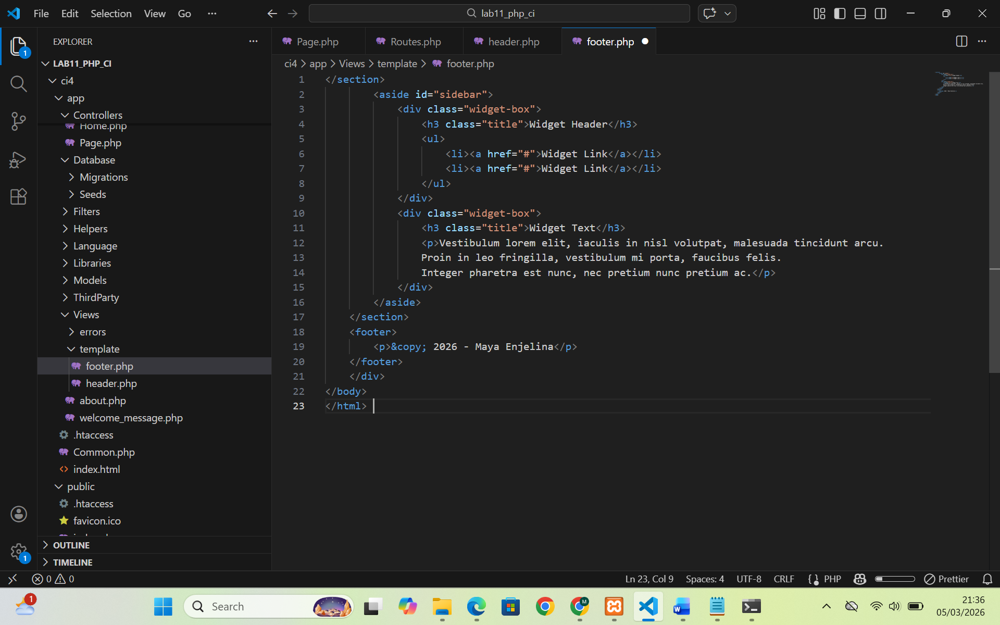

6. Menambahkan CSS
Agar tampilan sesuai dengan gambar pada modul, saya menambahkan file style.css di folder public/. CSS ini menggunakan teknik float untuk membagi area menjadi bagian main (konten) dan sidebar.
    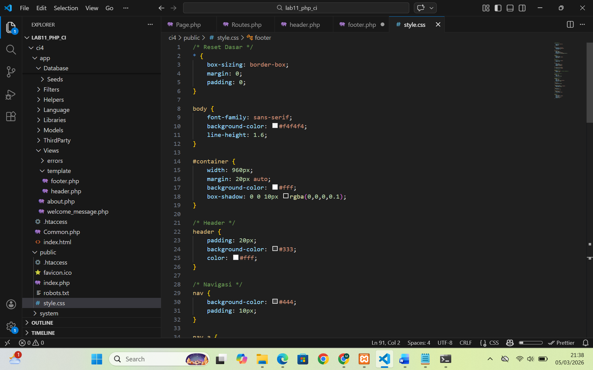
 
7. Hasil Akhir (Halaman About)
Saya memperbarui method pada Controller dan file View about.php agar menggunakan fungsi include untuk memanggil header dan footer.

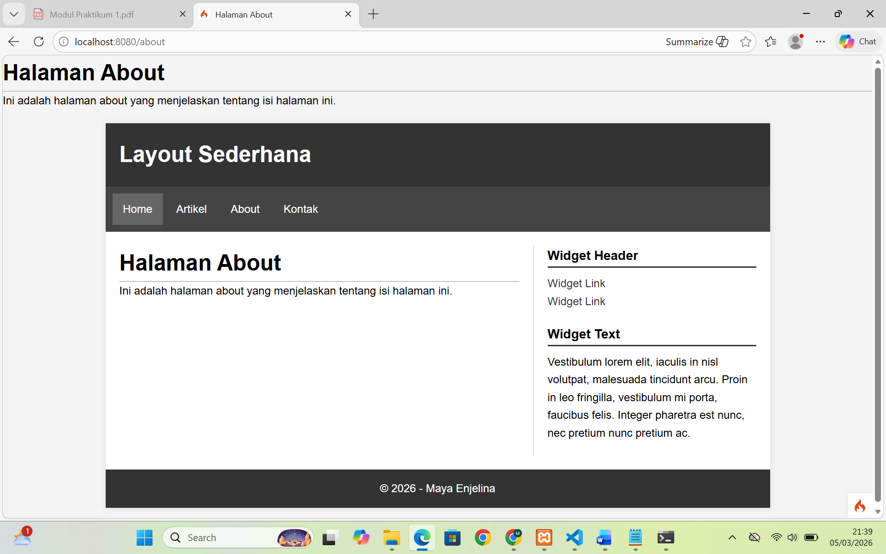

---

8. Penyelesaian Tugas (Menambah Menu Artikel dan Kontak)
Sesuai dengan instruksi pada bagian "Pertanyaan dan Tugas", saya telah melengkapi navigasi website dengan menambahkan halaman Artikel dan Kontak.

**Langkah yang dilakukan:**
1. **Update Controller**: Menambahkan method `artikel()` dan `contact()`.
2. **Membuat View**: Membuat file `artikel.php` dan `contact.php` di folder `app/Views/`.
3. **Navigasi Aktif**: Mengatur link pada `header.php` agar semua menu dapat diakses.

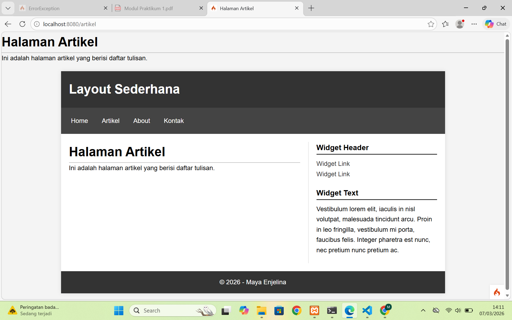
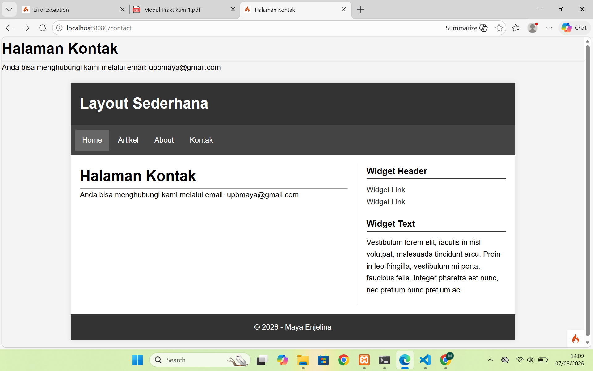

---

### 9. Kesimpulan
Pada praktikum ini, saya telah berhasil melakukan instalasi CodeIgniter 4, memahami konsep Routing dan Controller, serta mengimplementasikan teknik *Layouting* menggunakan fungsi `include`.
 
